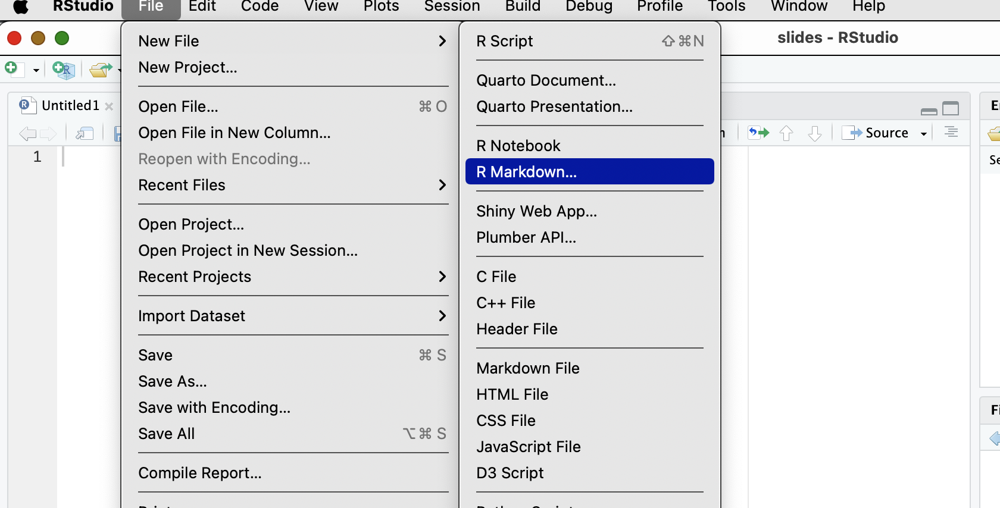
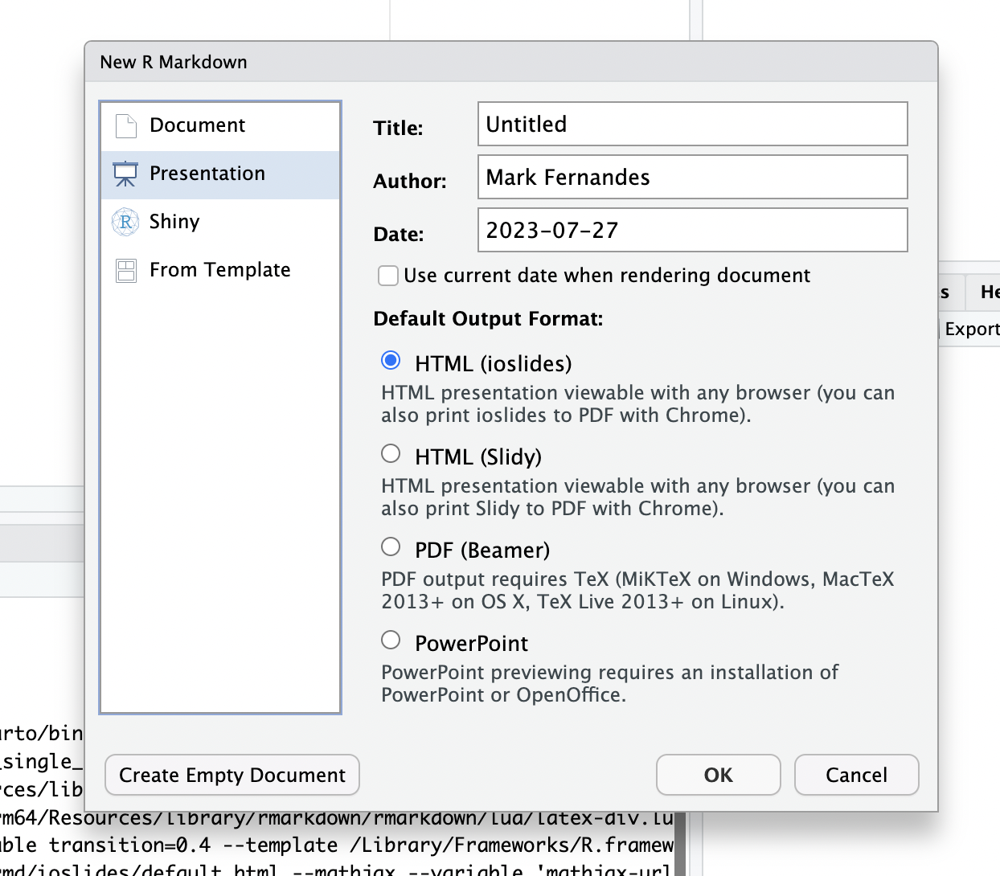
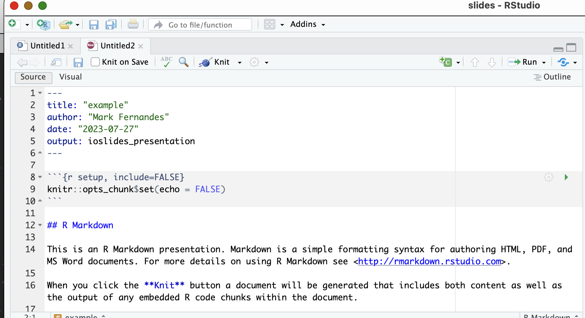
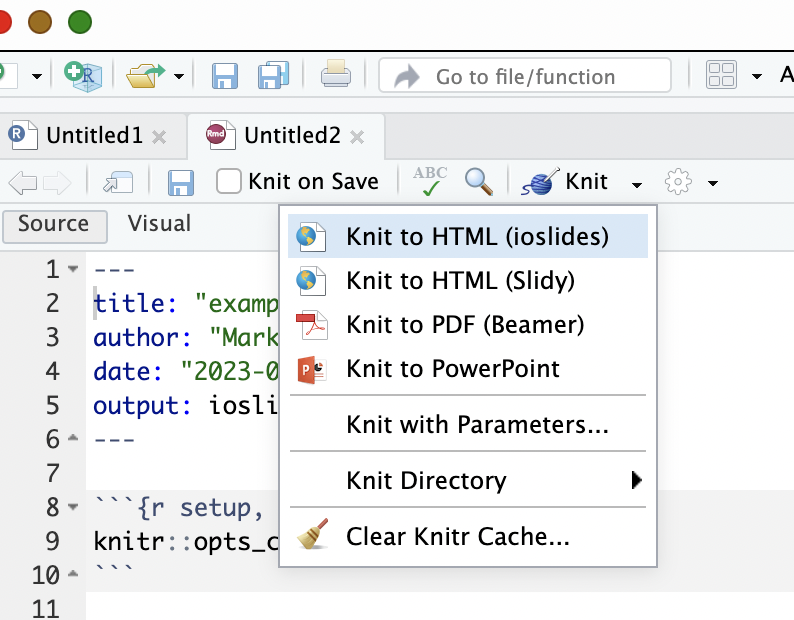
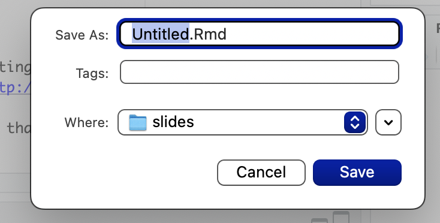

## Creating slideshow presentations in Rstudio
It is possible to achieve this from the Rstudio IDE (Integrated Development Environment)

### Creating a Markdown document be a basis for presentation

_Route 1 - creating from a blank document_   

First we must launch Rstudio on our computer and create a new project.   
Now we add a new Markdown document like this:

Rather than selecting the default of 'Document', we instead select 'Presentation' to get this screen:   

We are presented with 4 choices:
1. ioslides
2. slidy
3. beamer
4. powerpoint
   
These are all different packages for creating presentations - some are HTML-based, one is PDF-based and one uses MS Powerpoint (Note for preview to work on this option wither PowerPoint or OpenOffice MUST be installed on your machine). We will explore them al in due course.
For now, let's choose 'ioslides'.

As ever, when we create a new Markdown document, Rstudio adds some boiler plate example text so we can render it. Let's do that with the 'Knit' option.   

